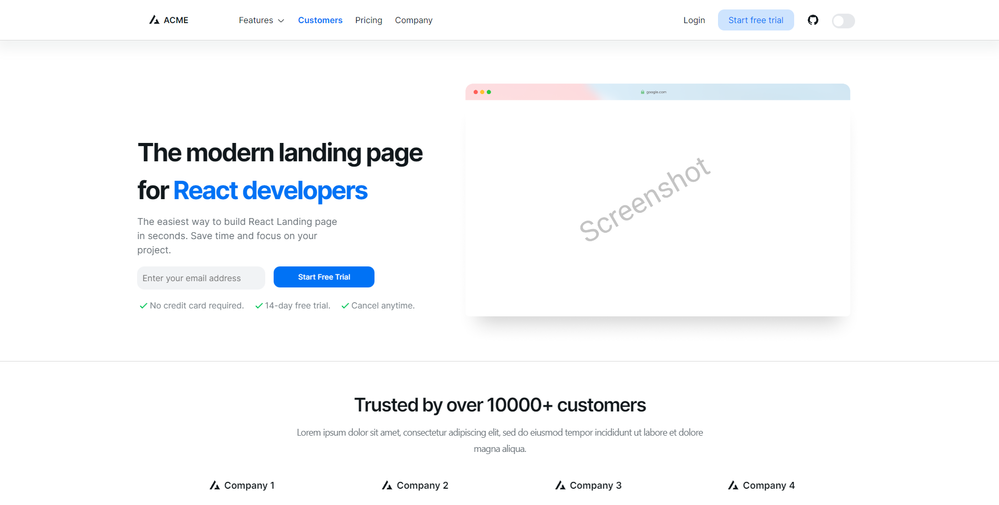

# NextJS and NextUI Landing Page Template

### Dark Mode


### Light Mode


- Hero Section
- Features Section 1
- Features Section 2
- Features Section 3
- Testimonials Section
- CTA Section
- Pricing Section
- FAQ Section
- Footer Section
- Dark Mode Support
- Full Responsive

## For Run

Install dependencies

    
```bash
npm install
```

Start the server

    
        
```bash
npm run dev
```

Now you can visit https://localhost:3000 in your browser.
